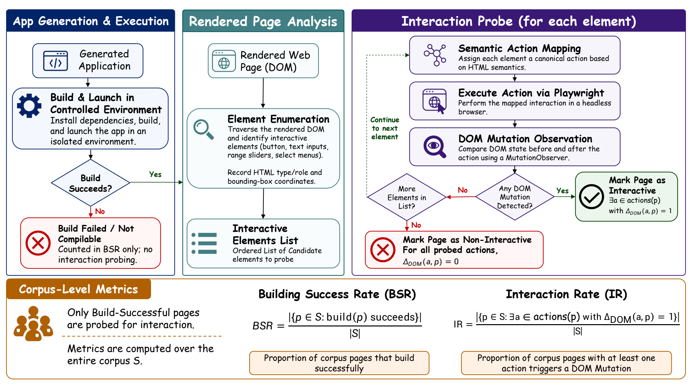
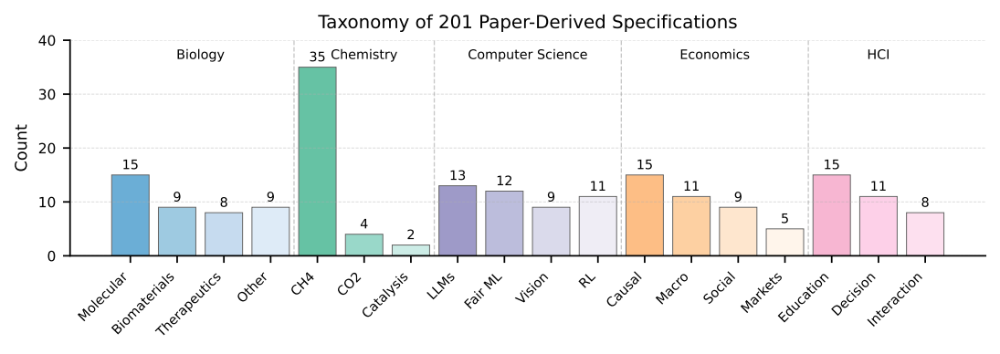
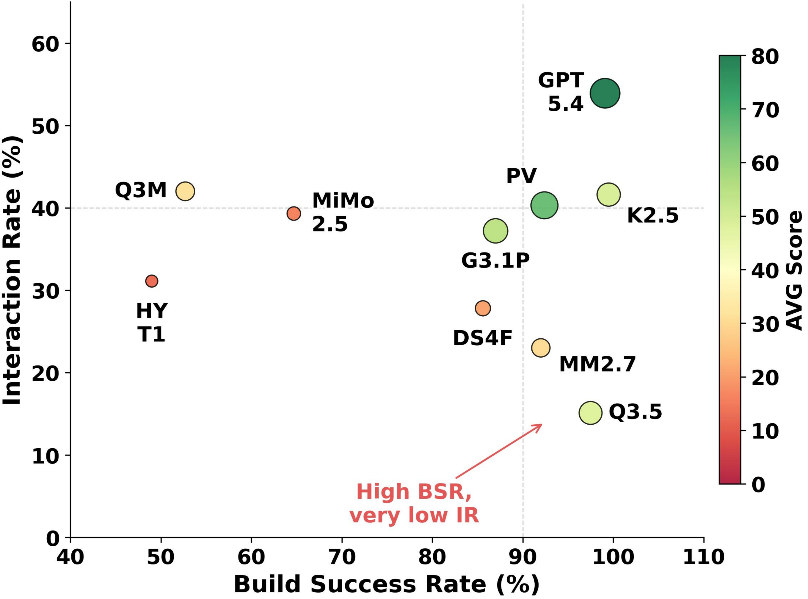
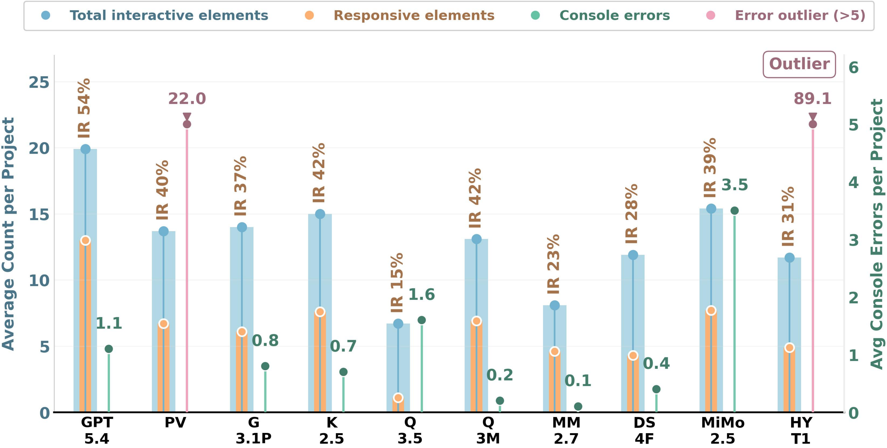

# I-WebGenBench

**Evaluating Interactivity in LLM-Generated Scientific Web Applications**

[](https://arxiv.org/abs/2606.00750)
[](LICENSE)
[](requirements.txt)

I-WebGenBench evaluates whether LLMs can generate **interactive scientific web applications** from paper-derived specifications. The benchmark explicitly separates apps that merely compile from apps that actually respond to user input with meaningful event-driven behavior.



## What This Release Contains

This repository keeps the runnable evaluation core:

| Component | File |
| --- | --- |
| PDF to task specification | `GeneratePrompt.py` |
| Task specification to React/TypeScript app | `generate_apps.py` |
| Batch Vite build | `tools/build_all_tsx.py` |
| Playwright Interaction Probe | `benchmark/runner/run_module_probe.py` |
| Batch probing | `benchmark/runner/run_module_probe_suite.py` |
| VLM judge | `benchmark/evaluation/evaluate_codegen_llm.py` |
| Score aggregation | `benchmark/evaluation/codegen_scorer.py` |

Large generated apps, benchmark result folders, local API keys, and runtime caches are intentionally excluded.

## Benchmark At A Glance

The arXiv v1 paper describes **201 paper-derived specifications** across five scientific domains.



| Domain | Count | Example subareas |
| --- | ---: | --- |
| Biology | 41 | Molecular biology, biomaterials, therapeutics |
| Chemistry | 41 | Plasma CH4 conversion, plasma CO2 conversion, catalysis |
| Computer Science | 45 | LLMs, fairness, vision, RL/planning |
| Economics | 40 | Causal inference, macro/finance, market design |
| HCI | 34 | Education, decision making, interaction design |

## Evaluation Protocol

I-WebGenBench combines deterministic browser probing with VLM-based qualitative scoring.

### 1. Build Success Rate

An app is build-successful if the generated Vite project produces:

```text
dist/index.html
```

### 2. Interaction Probe

For every build-successful app, the probe:

1. loads the rendered page in Chromium through Playwright;
2. enumerates visible interactive elements such as buttons, sliders, text inputs, and select menus;
3. records HTML semantics and bounding boxes;
4. maps each element to a canonical action, such as click, midpoint slider update, text input, or select change;
5. uses `MutationObserver` over `childList`, `subtree`, and `attributes` to detect DOM mutations after each action.

Interaction Rate (IR) is computed as:

```text
IR = pages with at least one DOM-mutating action / all pages
```

### 3. 100-Point Score

| Dimension | Points | Source |
| --- | ---: | --- |
| Visual Aesthetics | 30 | VLM judge |
| Interaction Fidelity | 40 | VLM judge over probe screenshots/logs |
| Topic & Semantic Alignment | 15 | VLM judge against the task specification |
| Clarity & Educational Value | 10 | VLM judge |
| Rule & Stability | 5 | deterministic probe |





## Main Result Snapshot

From the arXiv v1 paper:

| Rank | Model | Avg score |
| ---: | --- | ---: |
| 1 | GPT-5.4 | 79.4 |
| 2 | PaperVoyager | 65.9 |
| 3 | Gemini-3.1 | 53.8 |
| 4 | Kimi-K2.5 | 48.9 |
| 5 | Qwen-3.5 | 47.5 |

The main empirical finding is the **compilation-interaction gap**: many models achieve high build success, but substantially lower interaction rates.

## Install

```bash
pip install -r requirements.txt
playwright install chromium
```

Copy the environment template and fill in the keys you need:

```bash
cp .env.example .env
```

For prompt generation:

```bash
GEMINI_API_KEY=...
```

For code generation:

```bash
CODEGEN_PROVIDER=openai_compatible
CODEGEN_API_KEY=...
CODEGEN_BASE_URL=...
CODEGEN_MODEL=...
```

For optional VLM judging:

```bash
OPENAI_API_KEY=...
```

## Generate Apps

Generate paper-derived task specifications:

```bash
python GeneratePrompt.py \
  --pdf-dir Papers \
  --out-dir prompts \
  --workers 4
```

Generate React/TypeScript apps:

```bash
python generate_apps.py \
  --prompts-dir prompts \
  --out-base outputs/tsx \
  --workers 4
```

Build generated Vite projects:

```bash
python tools/build_all_tsx.py --path outputs/tsx --install
```

## Prepare `websites.json`

Serve the repository root:

```bash
python -m http.server 8000
```

Create a website list such as:

```json
{
  "websites": [
    {
      "id": "example_site",
      "start_url": "http://127.0.0.1:8000/outputs/tsx/example_site/dist/index.html"
    }
  ]
}
```

## Run Evaluation

Run the deterministic Interaction Probe:

```bash
python -m benchmark.runner.run_module_probe_suite \
  --websites benchmark/generated/model_websites/websites.json \
  --results_root benchmark/results \
  --run_id run_001 \
  --headless
```

Aggregate BSR, IR, Rule score, and any available VLM judge results:

```bash
python -m benchmark.evaluation.codegen_scorer \
  --websites benchmark/generated/model_websites/websites.json \
  --results_root benchmark/results \
  --run_id run_001 \
  --prompts_dir prompts \
  --out_table benchmark/generated/score_table.md
```

Optional wrapper for probe + OpenAI VLM judge + scorer:

```bash
python tools/run_full_codegen_eval.py \
  --websites benchmark/generated/model_websites/websites.json \
  --results_root benchmark/results \
  --run_id run_001 \
  --prompts_dir prompts \
  --headless \
  --out_table benchmark/generated/score_table.md
```

Add `--skip_judge` if you only want deterministic BSR/IR/Rule scoring.

## Prompt Pipeline

The paper uses a PDF-to-specification stage followed by code generation.

The released `GeneratePrompt.py` follows the prompt structure in the paper appendix:

- deep paper reading;
- 3-10 core interactive points;
- five modules: Hero/Abstract, Architecture/Methodology, Core Simulation/Experiment, Results/Analysis, Conclusion;
- structured natural-language specification focused on UI components, state variables, and visual logic.

The full paper also describes human expert review and filtering of the benchmark specifications. That curation stage is not reconstructed by this script. If you have the finalized benchmark prompts, use them directly for evaluation.

## Citation

```bibtex
@article{dai2026iwebgenbench,
  title={I-WebGenBench: Evaluating Interactivity in LLM-Generated Scientific Web Applications},
  author={Dai, Dasen and Wu, Biao and Fang, Meng and Li, Shuoqi and Wang, Wenhao},
  journal={arXiv preprint arXiv:2606.00750},
  year={2026}
}
```

## License

MIT License.
